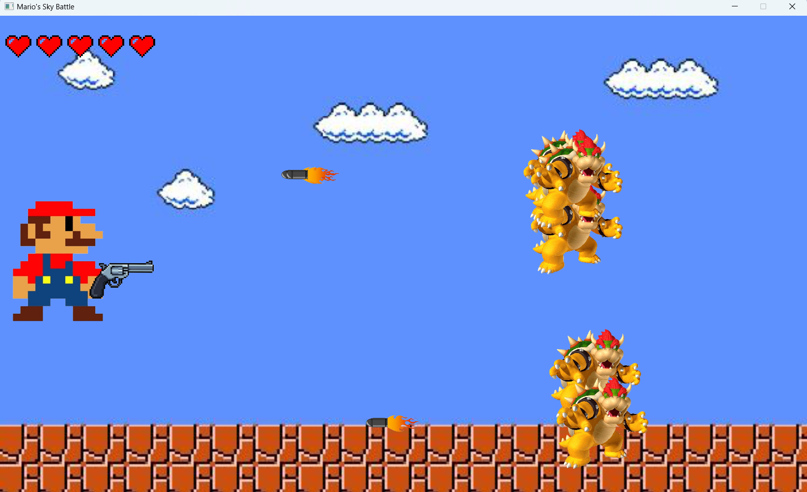
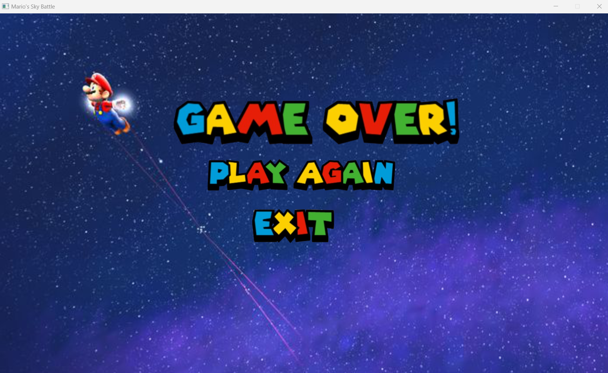

~**🚀🎮Welcome to Mario's Sky Battle!🎮🚀**~

Github link: https://github.com/a4338/CW2024.git

Welcome to Mario's Sky Battle, a thrilling Java-based game where Mario takes on his enemies, Bowser and Thwomp,
in an epic duel! This game is inspired by the retro classic 1942, revamped with a Mario-themed design and pixel art. ✨

This version is a themed version, and can run smoothly after the initial bugs that were present in the game were fixed.
There are three playable levels:

**Level 1**: Classic enemy shooting

**Level 2:** Boss battle with Thwomp

**Level 3:** Many enemies

**This game is ready for use.**

Compilation Instructions:

Prerequisites: JavaFX SDK Installed and add JavaFX libraries to the module paths

Instructions: 
1. Clone the repository from Github by running this command

   git clone <https://github.com/a4338/CW2024.git>

2. Locate the main file:
_"\CW2024-master\src\main\java\com\example\demo\controller\Main.java"_
3. Compile and run the Main Class
4. Start your adventure in Mario's Sky Battle!

Feature List
- **Implemented and working Properly:**
    1. **Main Menu**
       - Start Button: Launches the game.
       - Exit Button: Closes the application.

    2. **Levels (1-3)**
     - Functional and playable levels, all bugs from initial fork was fixed to ensure game runs smoothly
     - Player Controls 
        - Backwards: left arrow key
        - Front: right arrow key
        - Upwards: up arrow key
        - Downwards: down arrow key
        - Shooting projectiles: spacebar
        - Pause: P
        - Mute: M
     - Created a new level 3

    3. **Audio**
     - Integrated Mario sounds to the game
        - background.wav: plays from the start of the game, up until the user exits the game
        - userShoot.wav: plays every time user shoots a projectile
        - userDie.wav: plays when user runs out of lives and dies
        - gameOver.wav: plays subsequently after user dies, signalling the end of the game
        - userWin.wav: plays when user successfully goes through all 3 levels without dying
     - The background music will loop throughout the game
     - Once the game over audio finishes, the background.wav will continue where it left off

    4. Pause and Mute
      - Press P to pause/unpause the game. A pause overlay appears when paused.
      - Press M to toggle sound on/off.

    5. End Screen 
     - Displays upon winning/losing the game with options to replay or exit 

- **Implemented but Not Working Properly**
1. **Boss Shield (Level 2)**
    The boss shield is present, as proven in the troubleshooting logs. However, it is not visible.
    To address this, I used logs to serve as proof that the shield does exist and when it is deployed, the terminal will say
    'Shield initialized with size: 10' and 'Shield position updated to: ' to update the current position of the boss shield
    When the user succeeds in penetrating the boss shield, the terminal will output 'Boss took damage. Remaining health: ' to show
    how much health boss has left.

2. **Pause Overlay**
    When user pauses, there should be an image that appears to say 'Game Paused. Press P to resume' however it does not appear.
    Similar to boss shield, I used logs that would tell me in the terminal if the pause overlay is present.
    Now, when the pause button is clicked, the terminal will say 'Pause Overlay made visible' however it is not seen

**Features Not Implemented:**

There are a few features I would have liked to implement but did not. This could be due to lack of time and/or lack of skill.
Some of those features include:
1. Multiplayer Mode: Where there can be two players, one as the mario and one as his enemy
2. Character selection: User can change their character skins
3. More challenging enemies: Enemies can have different projectiles depending on the level difficulty

**New Java Classes:**
1. End Screen Controller / Main Menu Controller
    - Controllers for the FXML files(endScreen.fxml / MainMenu.fxml)

2. Audio Manager
    - Contains all the methods to control the music throughout the game
    - The music begins at the main menu page and will continue and loop throughout the game
    - When user wins/loses it will stop the background music and play a sound to indicate winning/losing before resuming the background music
    - All music stops when user exits the game

3. Level Three
    - New playable level
    - Similar to Level One but has a larger number of enemies to kill before game over

**Modified Java Classes:**
1. ActiveActor
- Added horizontal movement method: adding more functionality and to increase playability of the game

2. Boss
- Shield bug is fixed and shield can be activated
- Shield image is not visible
- Boss takes damage when not shielded but will not when it is shielded
- Boss shield activates at random intervals
- Lowered the fire rate to make the level easier

3. GameOverImage
- Fixed the sizing error that made the previous game over image not fit in screen
- Changed game over image to suit the theme

4. Level Parent
- Imported FXML Loader to load fxml files
- Imported Pause Transition for the pause feature
- Added Pause functionalities by creating togglePause, pauseGame, resumeGame and initializePauseOverlay methods
- Pause game will stop the game and the background music and display the pause overlay while resume game will continue the game where the player left off
- Added toggleMute method, when M is pressed the background sound will stop playing but the shooting sound will continue to play. When M is pressed again, the background sound is resumed
- initializeBackground method is updated to add more movement. Now, when users can move vertically as well as horizontally using all the arrow keys
- When P and M is pressed, game is paused and muted
- WinGame has an makes references to AudioManager to play the userWin sound effect and gameOver sound. When these sounds are being played, the backhground music is paused and
 only continues when done.
- For WinGame, there is a pause before transitioning to the game over screen, which makes the overall game smoother for the player
- LoseGame makes references to AudioManager. It will pause the music and play the userDie sound effect and the gameOver sound effect before resuming the background music
- Creation of goToEndScreen method when the game ends. It will load the end screen that allows players to play again or exit the application

5. Level One
- creation of variable declaration: levelTransitionInProgress = false; ensures single execution for transitioning from one level to the next
  when levelTransitionInProgress = true, the game will continue to the next level

6. LevelViewLevelTwo
 - Implemented the ShowShield, hideShield and updateShieldPosition methods. They contain debugging statements
    that allow users to know if shield is visible or hidden, and the location of the shield position

7. ShieldImage
- Added debugging statements

8. UserPlane
- Added sound effects when user fires a projectile
- Added moveForward and moveBackward methods
- Added a horizontalVelocityMultiplier for the horizontal movement

9. WinImage
- Changed the win image to better suit the theme

10. module-info.java
- requires javafx.fxml to be able to run the fxml files

Unexpected Problems:

1. Boss Shield Visibility (Level 2):

Despite functional debugging logs, the shield does not appear visually.
Attempts included ensuring the shield image path was correct and properly added to the scene graph.
2. Pause Overlay:

The image does not render visibly, though debugging confirms its presence.
3. Audio Duplication:

Background music restarted when transitioning between levels.
Resolved by ensuring the audio player is instantiated only once and not restarted.
JavaFX Compatibility:

4. Encountered errors when using mismatched JavaFX and JDK versions.
Resolved by aligning the JavaFX runtime and SDK versions
-----------------------------------------------------------------------------------------

Special thanks to my classmates, Sophiea, Fadilah, Izzah, Michelle and Aaron for helping me with this assignment.
This game would not have been possible without their support and collaboration.
-------------------
prepared by

Nurul Farah Atiqah
(ID: 20621543)
--------------------------------------------
## Screenshots 
### Main Menu

### Level One 

### Game Over
